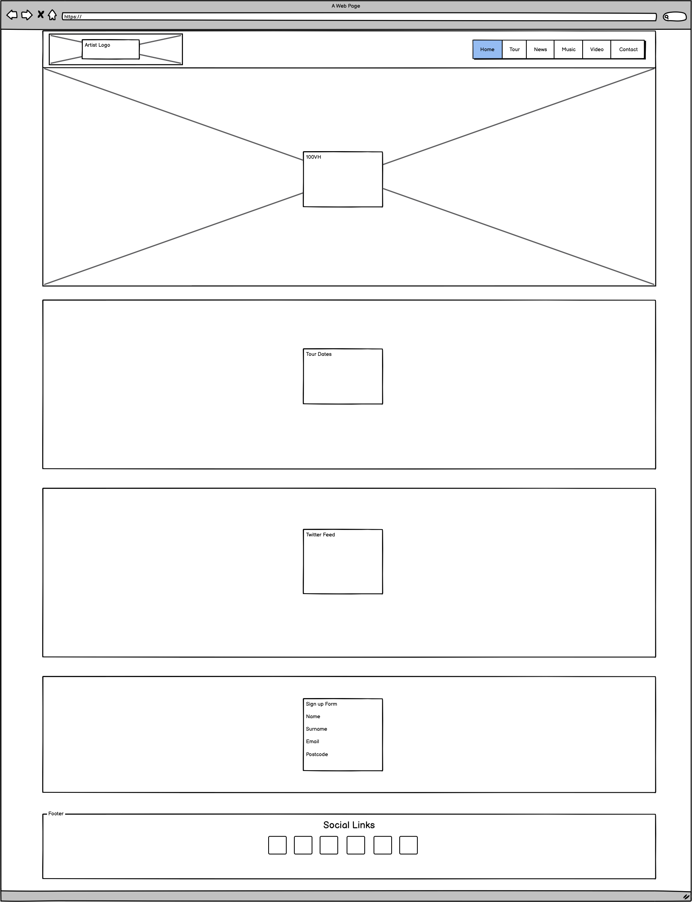
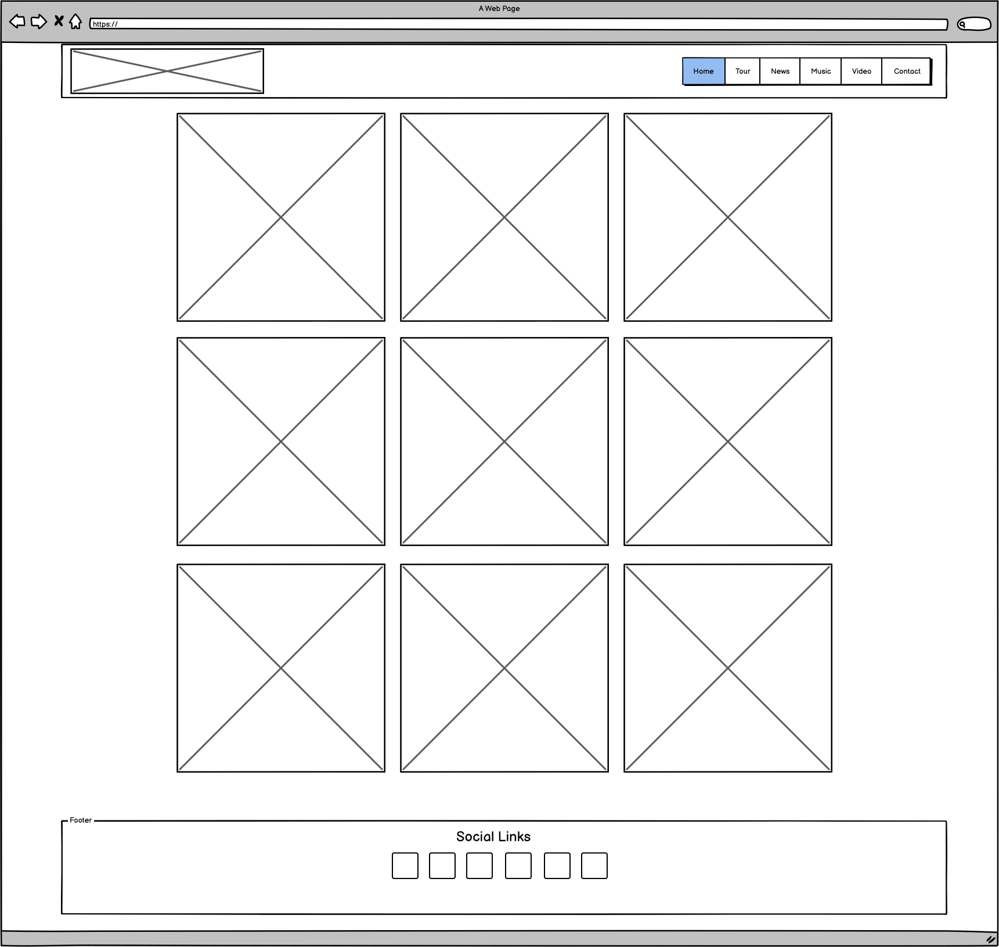
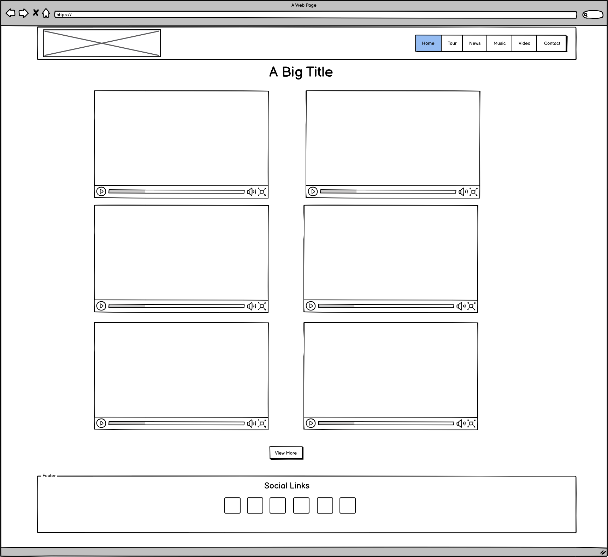
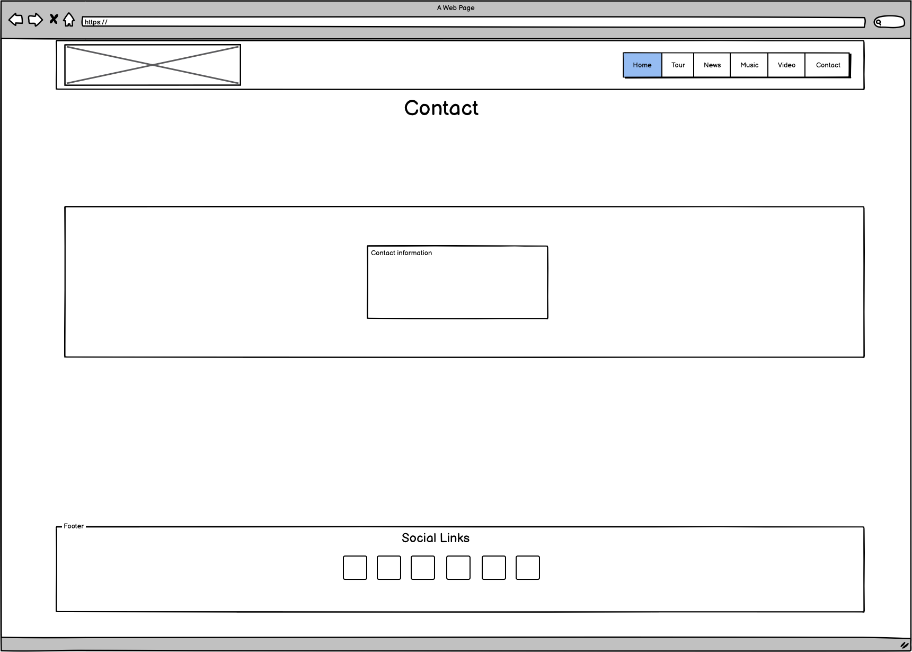

# Official Website for Betsie Gold

This website has been designed for the female pop artist Betsie Gold.  It was created with the idea to easily navigate through to socials and give fans a great visual experience to browse in until they do!
It is a simple design with only a few pages and scrolling links with an emphasis on the artist's chosen colour scheme. Access to content is simple and the website can be updated easily with new releases and content.
My motivation behind designing this website is because I play in the live band for Betsie Gold and have been helping her as an artist with visuals, production and general business dealings. Having a professional website to
send industry contacts to would be a huge asset.

## UX

The website is aimed at fans and newcomers and has all the latest information regarding live shows, new releases & latest tweets.
The site was designed as user friendly as possible with navigation being easy to follow and with the addition of a back to top button for desktop computers.
Active pages are highlighted and all buttons have hover effects to add to the experience.

## Website Wireframes (Using Balsamiq)

### Home Page

### Music Page

### Video Page

### Contact Page

## Features
### Existing Features

The website has 6 links in the nav of which 3 are scrolling and available to view on the homepage. The Music & Video pages have a similar layout with gold wrapping around the content and a columed layout.
The Music page has a overlay feature that fades in when you hover over the image that contains two links that slide in.  Both pages have a responsive layout that isn't too cluttered and with the video page having
a view more button to allow the user to go directly to the artist's Youtube Channel.

### Features left to implement

I'd like to add a dropdown link for the "Buy" and "Listen" icons that allow the user to choose their preffered platform
The sign-up form needs to be finished so the information gets stored in a directory for future use as a mailing list.
It would be amazing to add a small game or feature for younger fans to enjoy.  Something like this would be great for social media and back-links.
Ideally I would also add a store link with a platform where the artist can run her own sales and distribution or merchandise.

## Technologies Used

* HTML, CSS 

    Used to code, style and add content to the website.

* Bootstrap 4 - www.getbootstrap.com

    Used for layout and responsive elements in the website. including row and column layouts, forms and navbar elements.

## User Stories

- As a site visitor, I can be confident that I'm on the right website for Betsie Gold.
- As a site visitor, I can quickly navigate to social sites if that's where I actually want to end up.
- As a site visitor, I can see up to date news on Betsie Gold.
- As a site visitor, I can browse all of the latest musical releases.
- As a site visitor, I can browse all of the latest video releases.
- As a site visitor, I can see upcoming events and buy tickets.
- As a site visitor, I can sign up to the Betsie Gold Newsletter.
- As a site visitor, I can be sure that my sign up has gone through.
- As a site visitor, I can easily listen to or buy songs released by Betsie Gold.
- As a industry visitor, I can easily obtain contact information for Betsie Gold.
- As a site visitor, I can easily navigate between pages while browsing.
- As a site visitor, I can have all the same functionality on my phone and have a juicy hamburger menu like most phone apps.
- As a site visitor, I want to be able to get back to the home page quickly and easily, so I don’t get lost navigating.
and so the site works like every other site in the world. 
- 

## Testing 

The navigation of the website has been extensively tested and media queries added to ensure the site is responsive. The whole website was also tested by my partner extensively to help to identify any bugs or navigational pitfalls.

### Testing implemented: 

- #### Home

The layout of the home page has been tested through Devtools by resizing the window and seeing if all the media queries re-arrange the content to be as user firendly as possible.
Mobile view has to use a smaller image size for the Hero image which was checked in devtools and confirmed.  The Hero image is set to 100vh so I tested using the various devices 
in devtools and also my own personal devices (Ipad, Iphone) to ensure that the image is central and always the full height of the device.

  - #### Tour

The tour section of the website was tested with the smooth scrolling added to the html tag and confirmed. The ticket link was tested and ensured that the link opened in a new tab with the addition of _blank. 
The link destination in this case is Ticketmaster.com However for a fully funcitoning site this would direct to the actual events.
For smaller devices there is a span added between dates to make the layout more user friendly and to show a clear seperation.  This is then removed for larger devices and a buttom border added for each Div entry.
This was tested and confirmed through devtools by changing the browser size to make sure the changes were activated depending on the VP size of the device. This was also tested on my personal devices as a second 
confirmation of its functionality.

  - #### News

The news section is a simple twitter feed added through https://publish.twitter.com/ which was modified to remove the header and footer for a simpler layout that was less cluttered.  This was tested to make
sure that the top 2 tweets were always displayed and updated.  This was confirmed after reloading the page after the artist added a new post.

  - #### Music

The features on this page were tested by following all the "Listen" and "Buy" links to ensure they open in a seperate tab with the addition of _blank. The images that are attached to the releases are also scaled
to use smaller file sizes for mobile devices which was tested with devtools.  The layout of the images also change for mobile and tablet devices which was tested and adjusted to ensure the most visually appealing layout for each.

  - #### Video

The video page didn't require a large amount of testing. The only parts that were checked were the "View More" buttons to ensure they opened in a seperate tab and linked to the official youtube channel of the artist.
To ensure the layout changed for mobile devices I checked the changed through resizing in dev tools to ensure the video links resized and stayed within the device VP. I also used my personal devices to make sure the links worked and videos played while
still on the site.

  - #### Sign up

The sign up form was tested by adding all the relevant input values to see if the correct prediction appears and also a validation error if the field wasn't filled in when pushing the submit button.
I've also added a basic Success Modal, however for the form to work properly and to create a good modal pop-up I would need to dive into JavaScript. On this occasion my Mentor provided the necessary Javascript for the modal to work.

  - #### Contact

The email addressed added into the page were tested to ensure they open a relevant email providor and place the address into the "to" section.

## Deployment & Local Deploy

### Github Pages Deployment

* Once Project was finished it was then pushed to Github.
* Head to Github.com, login, then select the project repository.
* Click the settings tab and scroll down to the Github Pages section.
* Select the Master Branch in the "Source" section, followed by the root folder.
* Click save and the page should become live on the link provided above.

### Local Deployment

* Login to Github and select the project repository.
* Click on the Gitpod dropdown and download the files as a ZIP.
* Ensure that Git software is installed locally.
* Expand the ZIP file and double click the index.html file

## Credits

All the images used in the website were taken and edited by myself on behalf of Betsie Gold.

Inspiration for the site was taken from the following sites:

- https://www.katyperry.com/
- https://www.upsahl.com/
- https://www.billieeilish.com/

General research was done using youtube/google. No work was directly copied.

Dick Vlaanderen - Javascript for Bootstrap Modal

### 

